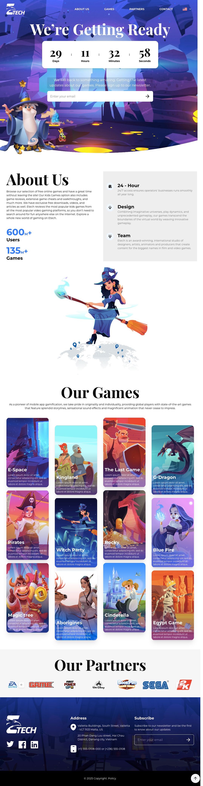
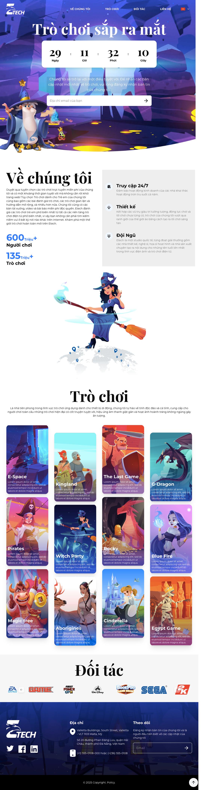

## Project Technology Summary

### Core Framework and Language
- [Next.js](https://nextjs.org/) (v15.2.2) - React framework for server-rendered applications
- [React](https://react.dev/) (v19.0.0) - JavaScript library for building user interfaces
- [TypeScript](https://www.typescriptlang.org/) (v5) - Typed JavaScript

### UI Components and Styling
- [Tailwind CSS](https://tailwindcss.com/) (v4) - Utility-first CSS framework
- [Shadcn](https://ui.shadcn.com/) - Unstyled, accessible component library

### Internationalization
- [next-intl](https://next-intl-docs.vercel.app/) (v4.0.2) - Internationalization library for Next.js

### Development Tools
- [ESLint](https://eslint.org/) (v9) - For code linting
- [Turbopack](https://turbo.build/pack) - Being used in development mode for faster builds

## Website Details

### Website URL
[https://tema-test-gray.vercel.app/](https://tema-test-gray.vercel.app/)

### Screenshots

The project includes screenshots for multiple device types and languages:

#### Desktop Views

| English | Vietnamese |
|---------|------------|
|  |  |

#### Mobile Views

| English | Vietnamese |
|---------|------------|
|  |  |
